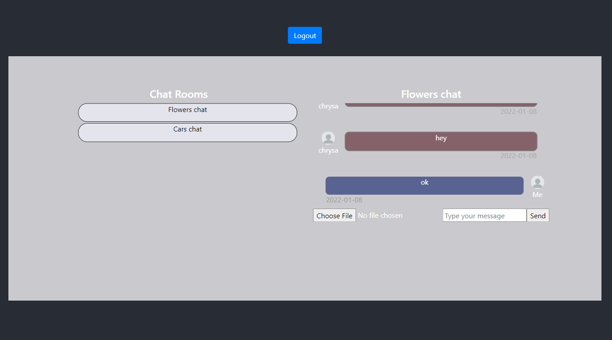

# Chat - Network Programming Project

 

### Applications
* RESTful Web Service developed with Spring Boot
* React client

### Technologies used:
* RESTful Web Services
* WebSockets
* Hibernate: implementation of JPA (Java Persistence Architecture)
* React: Front-end framework
* Axios: Javascript library used to make HTTP requests
* SockJS and STOMP
* H2 Database

### Techniques used:
* Token-based authentication

### The Chat

### How to run 
Run the ChatApplication class and access it using a browser using the following link: https://chat.localhost/.
